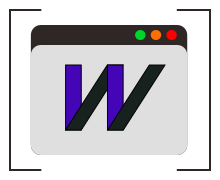

# Watrix
Watrix is a Windows 10 virtual desktop manager that organizes virtual desktops in a grid-like fashion.
You can use your arrow keys to move yourself and other windows between desktops.

Watrix is inspired by Ubuntu's (older) workspaces and Window's lack thereof.

## Usage
To use Watrix ensure you have [.NET 5.0](https://dotnet.microsoft.com/download) installed,
and simply need to download and run the Watrix executable.

### Keybindings
Watrix uses a variety of keybindings to  navigate the virtual desktop matrix.
Below is a list of the currently available keybindings:

- **Navigation**
    - *control+alt*+**left**: Navigate to the desktop to the left.
    - *control+alt*+**right**: Navigate to the desktop to the right.
    - *control+alt*+**up**: Navigate to the desktop above.
    - *control+alt*+**down**: Navigate to the desktop below.

- **Moving windows**
    - *control+shift+alt*+**left**: Move the current window to the desktop to the left.
    - *control+shift+alt*+**right**: Move the current window to the right.
    - *control+shift+alt*+**up**: Move the current window to the desktop above.
    - *control+shift+alt*+**down**: Move the current window to the desktop below.
- **Other**
    - *shift*+**escape**: Exit the program.   

Currently there is no way to modify the key binds (except by modifying the source code).

## Building
To build Watrix locally you can run the following commands.
Please not that Watrix is designed for Windows 10 only.

```bash
git clone https://github.com/lDisciple/Watrix.git
cd Watrix
dotnet restore
dotnet build
dotnet publish src/Watrix  -c Release  -r win10-x86 --self-contained false -p:PublishSingleFile=true --output ./build
```

Once published the .exe can be found in the build folder.
This EXE file will require the .NET core framework to be installed.

You can find more information on the various options for publishing [here](https://docs.microsoft.com/en-us/dotnet/core/tools/dotnet-publish).

## Roadmap
Below are features planned for future releases:

- [x] Hotkeys work
- [x] Switch desktops
- [x] Move windows between desktops
- [x] Overlay
    - [x] Design
    - [x] Show current desktop
    - [x] Show/hide overlay
- [ ] Set middle frame to desktop 0 (point to index function)
- [ ] Screenshots
    - [ ] Overlay background (prevents flickering)
    - [ ] Indicators (shows inside matrix quads)
- [ ] Configuration
    - [ ] Matrix size
    - [ ] Windows GUIDs
    - [ ] Keybindings
- [ ] Allow for use as a Windows service
- [ ] Package in an installer
- [ ] Windows GUID detector / Autoconfigure
- [ ] UI polish (ongoing)
 